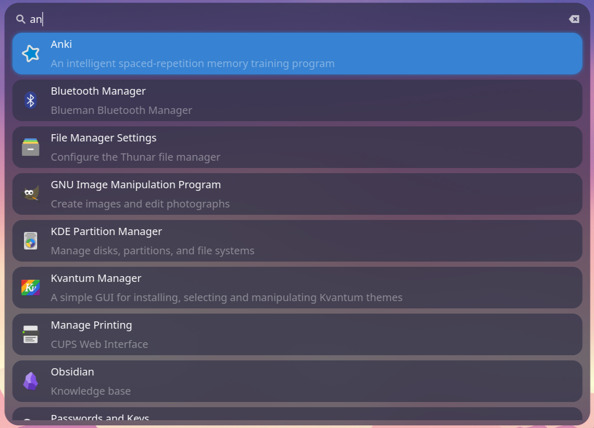
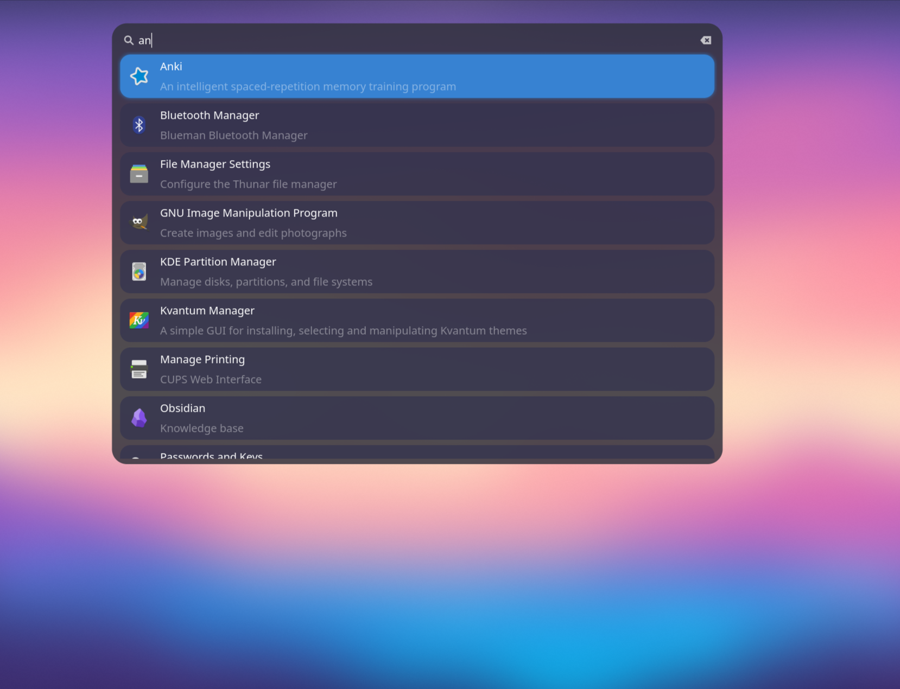

<div align="center">

# LumaStart
<i> A system Launcher </i>

[Installation](#installation) •
[Configuration](#configuration) •
[Integrations](#integrations) •
[Keybinds](#integrations)

---



---

</div>

# 🎯 Features
- AppLauncher
- config and Css file for styling
- Gtk 4 and Gtk4 Layer Shell

# 🧭 Roadmap
* [ ] fzf search
* [ ] Clipboard manager
* [ ] Calculator
* [ ] stdin

# 💻 Usage
```bash
lumastart
```
Example of adding a key bind in Hyprland to start `lumastart`.
```nix
wayland.windowManager.hyprland.settings = {
  "$mod" = "SUPER";
  bind = [
    "$mod, Space, exec, pkill lumastart || lumastart";
  ];
};

```

To get the blur working on Hyprland, you can add this:
```bash
layerrule=blur, ^(lumastart)$
```
<br>

To have the app only have blur and not the whole screen, you can add this:
```bash
layerrule=ignorezero, ^(lumastart)$
```
<br>
<details>
    <summary>Example Pic of full blur</summary>
    
</details>
<br>


# 🔨 Installation
### Nix
```nix
# flake
{
  inputs = {
    nixpkgs.url = "github:nixos/nixpkgs/nixos-unstable";

    lumastart.url = "github:spector700/lumastart";
  };
}
```
Then put the package in `environment.systemPackages` or `home.packages`

```nix
# packages
{ inputs, pkgs, ... }:
{
  home.packages = with pkgs; [
    inputs.lumastart.packages.${pkgs.system}.default
  ];
}
```

### Manual
Download and run the binary.

# ⚙️ Configuration
The default config and style files will be created at /.config/lumastart/
```bash
.config
└── lumastart
    ├── lumastart.conf
    └── style.css
```

# ⌨ Keybinds
| Key                                                                     | Description                        |
| ----------------------------------------------------------------------- | ---------------------------------- |
| `Enter`                                                                 | activate selection                 |
| `Arrow Keys`                                                            | Navigation                         |
| `Tab and Shift + Tab`                                                   | Navigation                         |
| `Escape`                                                                | close                              |
| `Click outside the window`                                              | close                              |

# 🚀 Build
### Dependencies
You need the following installed to build and run, or use the `nix dev shell`.

<i>Build tools:</i>
- cmake
- pkg-config
- meson
- ninja

<i>Libraries:</i>
- gtk4-layer-shell
- gtkmm4
- glibmm_2_68

### Run
```sh
cd lumastart
make run
```
